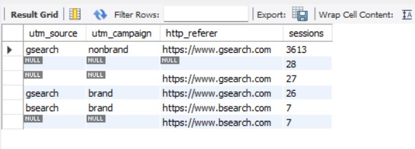
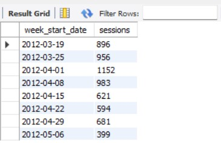

# Questions & solutions
-----------------------------------------------------------------------------------
Consider a scenario that you have joined the e-commerce organization as a business analyst and you are asked to query the databasee to get some useful insights that will help the organization grow. Some of the members will ask you some inights from their perpective, we need to query the database and provide the results to them.

#### Note : Please read the readme.md file to get the understanding of the data and its structure.

We will be working with six related tables, which contain eCommerce data about:
  • Website Activity
  • Products
  • Orders and Refunds
We'll use MySQL to understand how customers access and interact with the site, analyze landing page performance and conversion, and explore product level sales.

Paid traffic is commonly tagged with tracking (UTM) parameters, which are appended to URLs and allow us to tie website activity back to specific traffic sources and campaigns.
-----------------------------------------------------------------------------------

1. starting to generate sales. Can you help me understand where the bulk of our website sessions are coming from, through yesterday?
I’d like to see a breakdown by UTM source , campaign and referring domain if possible. Thanks!

```SQL
SELECT
	utm_source,
	utm_campaign,
	http_referer,
	COUNT(website_session_id) AS sessions
FROM 
	website sessions
WHERE 
	created at <2012-04-12 this Line is

GROUP BY
	1,2,3
ORDER BY
	sessions DESC;
```

Output:




-----------------------------------------------------------------------------------

2.	Based on your conversion rate analysis, we bid down gsearch nonbrand on 2012 04 15.
Can you pull gsearch nonbrand trended session volume, by week , to see if the bid changes have caused volume to drop at all?


```SQL
use websitedb;
SELECT
    WEEK(website_sessions.created_at) AS year_week,
    MIN(DATE(created_at)) AS week_start_date,
    COUNT(DISTINCT website_sessions.website_session_id) AS sessions
FROM website_sessions
WHERE website_sessions.created_at < '2012-05-10'
    AND website_sessions.utm_source='gsearch'
    AND website_sessions.utm_campaign= 'nonbrand'
GROUP BY 
    YEARWEEK(website_sessions.created_at);
```

Output:



-----------------------------------------------------------------------------------

3.	Could you pull conversion rates from session to order , by device type ?
If desktop performance is better than on mobile we may be able to bid up for desktop specifically to get more volume?


```SQL
SELECT 
	website_sessions.device_type,
    COUNT(DISTINCT website_sessions.website_session_id) as sessions,
    COUNT(DISTINCT orders.order_id) as Orders,
    COUNT(DISTINCT orders.order_id)/COUNT(DISTINCT website_sessions.website_session_id) as conversion_rate
FROM website_sessions 
	LEFT JOIN orders
    on orders.website_session_id = website_sessions.website_session_id
WHERE website_sessions.created_at < '2012-05-11'
	AND utm_source = 'gsearch'
	AND utm_campaign = 'nonbrand'
GROUP BY 1;
```

Output:


-----------------------------------------------------------------------------------

4.	We are interested in how diverse your film offering is as a means of understanding how likely you are to keep customers engaged in the future. Please provide a count of unique film titles you have in inventory at each store and then provide a count of the unique categories of films you provide. 


```SQL
SELECT 
	store_id, 
    	COUNT(DISTINCT film_id) AS unique_films
FROM inventory
GROUP BY 
	store_id;
-- and
SELECT 
	COUNT(DISTINCT name) AS unique_categories
FROM category;
```
The 1st query displays the unique film counts present in the inventory of each store and 
2nd query dislays the unique categories of the films in the database.(both output screenshots are attached)

Output:


-----------------------------------------------------------------------------------

5.	We would like to understand the replacement cost of your films. Please provide the replacement cost for the film that is least expensive to replace, the most expensive to replace, and the average of all films you carry.


```SQL
SELECT 
	MIN(replacement_cost) AS least_expensive, 
	MAX(replacement_cost) AS most_expensive, 
    	AVG(replacement_cost) AS average_replacement_cost
FROM film;
```
It displays the Minimum, Maximum and Average of replacement cost of the films.

Output:


-----------------------------------------------------------------------------------

6.	We would like to better understand what your customer base looks like. Please provide a list of all customer identification values, with a count of rentals they have made all-time, with your highest volume customers at the top of the list.

```SQL
SELECT 
	customer_id, 
    	COUNT(rental_id) AS number_of_rentals
FROM rental
GROUP BY 
	customer_id
ORDER BY 
	COUNT(rental_id) DESC
LIMIT 10;
```
It displays customer_id and number of rentals that the customer made and orders it in a descending order to get the highest rental at first(It will return 599 rows. but for viewing, i had given LIMIT 10 --> means it limits the records to 10).

Output:


-----------------------------------------------------------------------------------

7.	My partner and I want to come by each of the stores in person and meet the managers. Please send over the managers’ names at each store, with the full address of each property (street address, district, city, and country please).

```SQL
SELECT 
	staff.first_name AS manager_first_name, 
    	staff.last_name AS manager_last_name,
    	address.address, 
    	address.district, 
    	city.city, 
    	country.country
FROM store
	LEFT JOIN staff ON store.manager_staff_id = staff.staff_id
    	LEFT JOIN address ON store.address_id = address.address_id
    	LEFT JOIN city ON address.city_id = city.city_id
    	LEFT JOIN country ON city.country_id = country.country_id;
```
Here address database is split up into 3 databases. So we need to join those tables to fetech the records. This will display the Manager's Name and address.

Output:


-----------------------------------------------------------------------------------

8.	I would like to get a better understanding of all of the inventory that would come along with the business. Please pull together a list of each inventory item you have stocked, including the store_id number, the inventory_id, the name of the film, the film’s rating, its rental rate and replacement cost. 

```SQL
SELECT 
	inventory.store_id, 
	inventory.inventory_id, 
	film.film_id,
	film.title, 
	film.rating, 
	film.rental_rate, 
	film.replacement_cost
FROM inventory
	LEFT JOIN film
	ON inventory.film_id = film.film_id
LIMIT 10;
```
This query will displays the list of each inventory item you have stocked, including the store_id number, the inventory_id, the name of the film, the film’s rating, its rental rate and replacement cost(This query also pulls 4581 records from database, so i have used LIMIT 10).

Output:


-----------------------------------------------------------------------------------

9.	Similarly, we want to understand how diversified the inventory is in terms of replacement cost. We want to see how big of a hit it would be if a certain category of film became unpopular at a certain store. We would like to see the number of films, as well as the average replacement cost, and total replacement cost, 
sliced by store and film category. 

```SQL
SELECT 
	store_id, 
    	category.name AS category, 
	COUNT(inventory.inventory_id) AS films, 
    	AVG(film.replacement_cost) AS avg_replacement_cost, 
    	SUM(film.replacement_cost) AS total_replacement_cost
FROM inventory
	LEFT JOIN film
		ON inventory.film_id = film.film_id
	LEFT JOIN film_category
		ON film.film_id = film_category.film_id
	LEFT JOIN category
		ON category.category_id = film_category.category_id
GROUP BY 
	store_id, 
    	category.name
ORDER BY 
	total_replacement_cost DESC
LIMIT 10;
```
This Query will return the the number of films, as well as the average replacement cost, and total replacement cost, sliced by store and film category(This query also pulls 32 records from database, so i have used LIMIT 10)

Output:


-----------------------------------------------------------------------------------

10.	We would like to understand how much your customers are spending with you, and also to know who your most valuable customers are. Please pull together a list of customer names, their total lifetime rentals, and the sum of all payments you have collected from them. It would be great to see in this order on total lifetime value, with the most valuable customers at the top of the list.

```SQL
SELECT 
	customer.first_name, 
    	customer.last_name, 
    	COUNT(rental.rental_id) AS total_rentals, 
    	SUM(payment.amount) AS total_payment_amount
FROM customer
	LEFT JOIN rental 
		ON customer.customer_id = rental.customer_id
    	LEFT JOIN payment 
		ON rental.rental_id = payment.rental_id
GROUP BY 
	customer.first_name,
    	customer.last_name
ORDER BY 
	SUM(payment.amount) DESC
LIMIT 10;
```
This will display the Name, Total rentals, and sum of the payments of the customers  and it will display it in the descending order to get the most valuable customers on top of the list(This query also pulls 599 records from database, so i have used LIMIT 10 --> We can take it as Top 10 Customers).

Output:


-----------------------------------------------------------------------------------

11.	My partner and I would like to get to know your board of advisors and any current investors. Could you please provide a list of advisor and investor names in one table? Could you please note whether they are an investor or an advisor, and for the investors, it would be good to include which company they work with. 

```SQL
SELECT
	'investor' AS type, 
    	first_name, 
    	last_name, 
    	company_name
FROM investor
UNION 
SELECT 
	'advisor' AS type, 
    	first_name, 
    	last_name, 
    	'-' as company_name
FROM advisor;
```
Here we have to pull the records of name and company_name(investor) for investor and advisor from their respective tables. Here we have didn't have a column called type so we have defined to print the type in the SELECT statement. Also, we didn't have the company_name column for advisor table, so we have defined to '-' for the company_name column. Also, we have used UNION to merge the records and display it in a same table.(Note : UNION will be used to merge 2 or more SELECT quries, only when type of the columns that are used in both SELECT statements are Equal(eg:INT, FLOAT, CHAR, etc.))

Output:


-----------------------------------------------------------------------------------

12.	We're interested in how well you have covered the most-awarded actors. Of all the actors with three types of awards, for what % of them do we carry a film? And how about for actors with two types of awards? Same questions. Finally, how about actors with just one award? 

```SQL
SELECT
	CASE 
		WHEN actor_award.awards = 'Emmy, Oscar, Tony ' THEN '3 awards'
        	WHEN actor_award.awards IN ('Emmy, Oscar','Emmy, Tony', 'Oscar, Tony') THEN '2 awards'
		ELSE '1 award'
	END AS number_of_awards, 
    	ROUND(AVG(CASE WHEN actor_award.actor_id IS NULL THEN 0 ELSE 1 END)*100,0) AS Percentage_of_films
FROM actor_award
GROUP BY 
	number_of_awards;
```
Here we have used case statement to classify the number of awards got by the actors and we have used ROUND and AVG function to get the percentage of the films those actors acted in the films that are present in the store.

Output:


-----------------------------------------------------------------------------------
