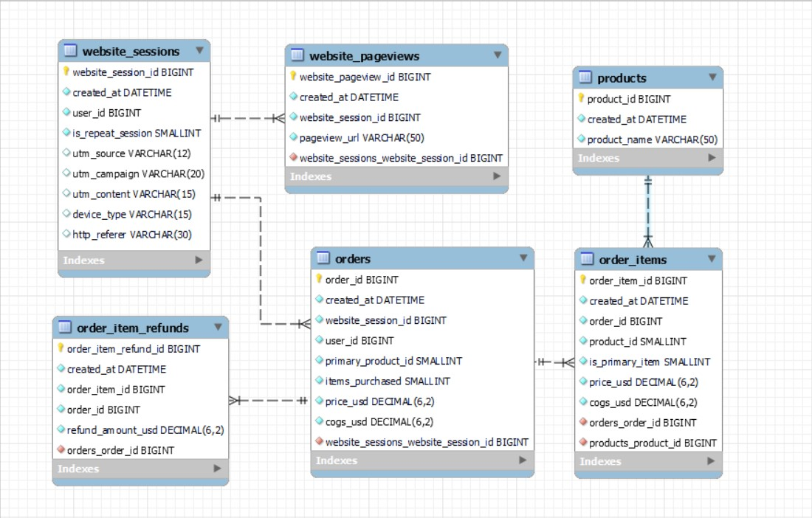

# websitedb_MySQL
 This Project consists of website Data.  I have used advanced sql concepts for querying the database and get the insights to solve the queries raised from the business perspective.

---

This database consists of 6 tables, 36 columns, 12 indexes.

I am attaching the ER Diagram to view the dataase and also the connections between the tables so that you can understand the database better.

---

Here, Website_sessions table is the main table that will give us how the traffic of the website is created. It uses the UTM(urchin Tracking Module) to know the users data of how they were logging.

UTM Parameters:
 * utm_source     -->  utm_source will gives the data, that how the user lands in our page.(eg: gsearch means uses google search to land in our page) 
 * utm_campaign   -->  utm_campaign will gives the data of campaign name that were set with the utm_source.(eg: brand, non-brand etc.)
 * utm_content    -->  utm_content is used to track the traffic that where the user clicks to get the landing page.(eg: g_ad_1 means advertiment 1 published on google.)

These are the new parameters, that is used in this database. Other columns like order_id, website_session_id, product_name etc are normally identified.

---
