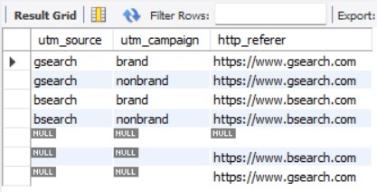

# Questions & solutions
-----------------------------------------------------------------------------------
Consider a scenario that you have joined the e-commerce organization as a business analyst and you are asked to query the databasee to get some useful insights that will help the organization grow. Some of the members will ask you some inights from their perpective, we need to query the database and provide the results to them.

#### Note : Please read the readme.md file to get the understanding of the data and its structure.

We will be working with six related tables, which contain eCommerce data about:
  • Website Activity
  • Products
  • Orders and Refunds
We'll use MySQL to understand how customers access and interact with the site, analyze landing page performance and conversion, and explore product level sales.

Paid traffic is commonly tagged with tracking (UTM) parameters, which are appended to URLs and allow us to tie website activity back to specific traffic sources and campaigns.
-----------------------------------------------------------------------------------

1. starting to generate sales. Can you help me understand where the bulk of our website sessions are coming from, through yesterday?
I’d like to see a breakdown by UTM source , campaign and referring domain if possible. Thanks!

```SQL
SELECT
	utm_source,
	utm_campaign,
	http_referer,
	COUNT(website_session_id) AS sessions
FROM website sessions
WHERE created at <2012-04-12 this Line is
GROUP BY 1,2,3
ORDER BY sessions DESC;
```

Output:


-----------------------------------------------------------------------------------

2.	Based on your conversion rate analysis, we bid down gsearch nonbrand on 2012 04 15.
Can you pull gsearch nonbrand trended session volume, by week , to see if the bid changes have caused volume to drop at all?


```SQL
use websitedb;
SELECT
    WEEK(website_sessions.created_at) AS year_week,
    MIN(DATE(created_at)) AS week_start_date,
    COUNT(DISTINCT website_sessions.website_session_id) AS sessions
FROM website_sessions
WHERE website_sessions.created_at < '2012-05-10'
    AND website_sessions.utm_source='gsearch'
    AND website_sessions.utm_campaign= 'nonbrand'
GROUP BY YEARWEEK(website_sessions.created_at);
```

Output:


-----------------------------------------------------------------------------------

3.	Could you pull conversion rates from session to order , by device type ?
If desktop performance is better than on mobile we may be able to bid up for desktop specifically to get more volume?


```SQL
SELECT 
    website_sessions.device_type,
    COUNT(DISTINCT website_sessions.website_session_id) as sessions,
    COUNT(DISTINCT orders.order_id) as Orders,
    COUNT(DISTINCT orders.order_id)/COUNT(DISTINCT website_sessions.website_session_id) as conversion_rate
FROM website_sessions 
	LEFT JOIN orders
    on orders.website_session_id = website_sessions.website_session_id
WHERE website_sessions.created_at < '2012-05-11'
	AND utm_source = 'gsearch'
	AND utm_campaign = 'nonbrand'
GROUP BY 1;
```

Output:


-----------------------------------------------------------------------------------

4.	Gsearch seems to be the biggest driver of our business. Could you pull monthly trends for gsearch sessions and orders so that we can showcase the growth there?

```SQL
SELECT
	YEAR(website_sessions.created_at) AS yr, 
    MONTH(website_sessions.created_at) AS mo, 
    COUNT(DISTINCT website_sessions.website_session_id) AS sessions, 
    COUNT(DISTINCT orders.order_id) AS orders, 
    COUNT(DISTINCT orders.order_id)/COUNT(DISTINCT website_sessions.website_session_id) AS conv_rate
FROM website_sessions
	LEFT JOIN orders 
		ON orders.website_session_id = website_sessions.website_session_id
WHERE website_sessions.created_at < '2012-11-27'
	AND website_sessions.utm_source = 'gsearch'
GROUP BY 1,2;
```

Output:


-----------------------------------------------------------------------------------

5.	Next, it would be great to see a similar monthly trend for Gsearch, but this time splitting out nonbrand and brand campaigns separately. I am wondering if brand is picking up at all. If so, this is a good story to tell.


```SQL
SELECT
    YEAR(website_sessions.created_at) AS yr, 
    MONTH(website_sessions.created_at) AS mo, 
    COUNT(DISTINCT CASE WHEN utm_campaign = 'nonbrand' THEN website_sessions.website_session_id ELSE NULL END) AS nonbrand_sessions, 
    COUNT(DISTINCT CASE WHEN utm_campaign = 'nonbrand' THEN orders.order_id ELSE NULL END) AS nonbrand_orders,
    COUNT(DISTINCT CASE WHEN utm_campaign = 'brand' THEN website_sessions.website_session_id ELSE NULL END) AS brand_sessions, 
    COUNT(DISTINCT CASE WHEN utm_campaign = 'brand' THEN orders.order_id ELSE NULL END) AS brand_orders
FROM website_sessions
	LEFT JOIN orders 
	ON orders.website_session_id = website_sessions.website_session_id
WHERE website_sessions.created_at < '2012-11-27'
	AND website_sessions.utm_source = 'gsearch'
GROUP BY 1,2;
```

Output:


-----------------------------------------------------------------------------------

6.	I’m worried that one of our more pessimistic board members may be concerned about the large % of traffic from Gsearch. Can you pull monthly trends for Gsearch, alongside monthly trends for each of our other channels?

First, finding the various utm sources and referers to see the traffic we're getting

```SQL
SELECT DISTINCT 
    utm_source,
    utm_campaign, 
    http_referer
FROM website_sessions
WHERE website_sessions.created_at < '2012-11-27'
ORDER BY 1 DESC;
```
Next we will pull the monthly trends for Gsearch.
```SQL
SELECT
    YEAR(website_sessions.created_at) AS yr, 
    MONTH(website_sessions.created_at) AS mo, 
    COUNT(DISTINCT CASE WHEN utm_source = 'gsearch' THEN website_sessions.website_session_id ELSE NULL END) AS gsearch_paid_sessions,
    COUNT(DISTINCT CASE WHEN utm_source = 'bsearch' THEN website_sessions.website_session_id ELSE NULL END) AS bsearch_paid_sessions,
    COUNT(DISTINCT CASE WHEN utm_source IS NULL AND http_referer IS NOT NULL THEN website_sessions.website_session_id ELSE NULL END) AS organic_search_sessions,
    COUNT(DISTINCT CASE WHEN utm_source IS NULL AND http_referer IS NULL THEN website_sessions.website_session_id ELSE NULL END) AS direct_type_in_sessions
FROM website_sessions
	LEFT JOIN orders 
		ON orders.website_session_id = website_sessions.website_session_id
WHERE website_sessions.created_at < '2012-11-27'
GROUP BY 1,2;
```
Output:




-----------------------------------------------------------------------------------

7.	I’d like to tell the story of our website performance improvements over the course of the first 8 months. Could you pull session to order conversion rates, by month? 

```SQL
SELECT
	YEAR(website_sessions.created_at) AS yr, 
    MONTH(website_sessions.created_at) AS mo, 
    COUNT(DISTINCT website_sessions.website_session_id) AS sessions, 
    COUNT(DISTINCT orders.order_id) AS orders, 
    COUNT(DISTINCT orders.order_id)/COUNT(DISTINCT website_sessions.website_session_id) AS conversion_rate    
FROM website_sessions
	LEFT JOIN orders 
		ON orders.website_session_id = website_sessions.website_session_id
WHERE website_sessions.created_at < '2012-11-27'
GROUP BY 1,2;
```

Output:


-----------------------------------------------------------------------------------

8.	For the gsearch lander test, please estimate the revenue that test earned us.(Hint: Look at the increase in CVR from the test (Jun 19 – Jul 28), and use nonbrand sessions and revenue since then to calculate incremental value)

As, First step, we'll find the first pageview id 

```SQL
SELECT
	MIN(website_pageview_id) AS first_test_pv
FROM website_pageviews
WHERE pageview_url = '/lander-1';
```
Output:
-----------------
| first_test_pv	|
|---------------|
| 23504		|
-----------------

Next, we will take the first pageview id and create a temporary table(Please go through the README.md to know the useage of Temporary Table).

```SQL
CREATE TEMPORARY TABLE first_test_pageviews
SELECT
    website_pageviews.website_session_id, 
    MIN(website_pageviews.website_pageview_id) AS min_pageview_id
FROM website_pageviews 
	INNER JOIN website_sessions 
		ON website_sessions.website_session_id = website_pageviews.website_session_id
		AND website_sessions.created_at < '2012-07-28'
		AND website_pageviews.website_pageview_id >= 23504 -- first page_view
        AND utm_source = 'gsearch'
        AND utm_campaign = 'nonbrand'
GROUP BY 
	website_pageviews.website_session_id;

select * from first_test_pageviews;  -- To view the Temp Table
```
It will return 4577 Rows.

Output:


Next, we'll bring in the landing page to each session, like last time, but restricting to home or lander-1 this time

```SQL
CREATE TEMPORARY TABLE nonbrand_test_sessions_w_landing_pages
SELECT 
    first_test_pageviews.website_session_id, 
    website_pageviews.pageview_url AS landing_page
FROM first_test_pageviews
	LEFT JOIN website_pageviews 
		ON website_pageviews.website_pageview_id = first_test_pageviews.min_pageview_id
WHERE website_pageviews.pageview_url IN ('/home','/lander-1'); 

select * from nonbrand_test_sessions_w_landing_pages;  -- To view the Temp Table
```
It will return 4577 Rows.

Output:


Then, we make a table to bring in orders.
```SQL
CREATE TEMPORARY TABLE nonbrand_test_sessions_w_orders
SELECT
    nonbrand_test_sessions_w_landing_pages.website_session_id, 
    nonbrand_test_sessions_w_landing_pages.landing_page, 
    orders.order_id AS order_id
FROM nonbrand_test_sessions_w_landing_pages
LEFT JOIN orders 
	ON orders.website_session_id = nonbrand_test_sessions_w_landing_pages.website_session_id;

SELECT * FROM nonbrand_test_sessions_w_orders ORDER BY order_id desc;
```
Output:


Now, We can find the difference between conversion rates.

```SQL
SELECT
    landing_page, 
    COUNT(DISTINCT website_session_id) AS sessions, 
    COUNT(DISTINCT order_id) AS orders,
    COUNT(DISTINCT order_id)/COUNT(DISTINCT website_session_id) AS conv_rate
FROM nonbrand_test_sessions_w_orders
GROUP BY 1; 
```
So, we can tell that, 0.0319 for /home, vs 0.0406 for /lander-1 0.0087 additional orders per session.

Output:


Now, we will find the most recent pageview for gsearch nonbrand where the traffic was sent to /home.

```SQL
SELECT 
	MAX(website_sessions.website_session_id) AS most_recent_gsearch_nonbrand_home_pageview 
FROM website_sessions 
	LEFT JOIN website_pageviews 
		ON website_pageviews.website_session_id = website_sessions.website_session_id
WHERE utm_source = 'gsearch'
    AND utm_campaign = 'nonbrand'
    AND pageview_url = '/home'
    AND website_sessions.created_at < '2012-11-27';
```

Output:
-------------------------------------------------
|  most_recent_gsearch_nonbrand_home_pageview	|
|-----------------------------------------------|
|  17145					|
-------------------------------------------------
So, we cgot the most recent gsearch nonbrand home pageview website session id.

As a last step, we can query the above details to get the sessions that are created after the test.

```SQL
SELECT 
	COUNT(website_session_id) AS sessions_since_test
FROM website_sessions
WHERE created_at < '2012-11-27'
	AND website_session_id > 17145 -- last /home session
	AND utm_source = 'gsearch'
	AND utm_campaign = 'nonbrand';
```

Output:
-------------------------
| sessions_since_test	|
|-----------------------|
| 22972			|
-------------------------
---

9.	I’d love for you to quantify the impact of our billing test, as well. Please analyze the lift generated from the test (Sep 10 – Nov 10), in terms of revenue per billing page session, and then pull the number of billing page sessions for the past month to understand monthly impact.

```SQL
SELECT
    billing_version_seen, 
    COUNT(DISTINCT website_session_id) AS sessions, 
    SUM(price_usd)/COUNT(DISTINCT website_session_id) AS revenue_per_billing_page_seen
 FROM( 
	SELECT 
		website_pageviews.website_session_id, 
    		website_pageviews.pageview_url AS billing_version_seen, 
    		orders.order_id, 
    		orders.price_usd
	FROM website_pageviews 
		LEFT JOIN orders
			ON orders.website_session_id = website_pageviews.website_session_id
	WHERE website_pageviews.created_at > '2012-09-10' -- prescribed in assignment
		AND website_pageviews.created_at < '2012-11-10'
    		AND website_pageviews.pageview_url IN ('/billing','/billing-2')
     ) AS billing_pageviews_and_order_data
GROUP BY 1;
```
Output:


Here, $22.83 revenue per billing page seen for the old version and $31.34 for the new version. So, we can tell that the revenue is lifted $8.51 per billing page view.

```SQL
SELECT 
	COUNT(website_session_id) AS billing_sessions_past_month
FROM website_pageviews 
WHERE website_pageviews.pageview_url IN ('/billing','/billing-2') 
	AND created_at BETWEEN '2012-10-27' AND '2012-11-27'
```
Here we have used case statement to classify the number of awards got by the actors and we have used ROUND and AVG function to get the percentage of the films those actors acted in the films that are present in the store.

Output:
---------------------------------
| billing_sessions_past_month	|
|-------------------------------|
| 1193				|
---------------------------------

1,193 billing sessions past month and the LIFT is $8.51 per billing session. So, VALUE OF BILLING TEST: $10,160 over the past month.

-----------------------------------------------------------------------------------
